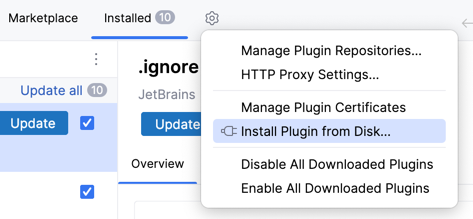
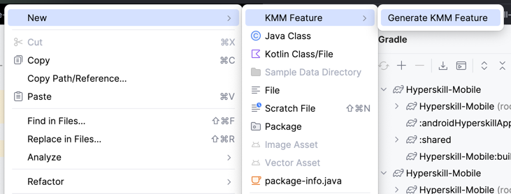
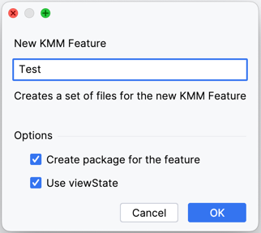
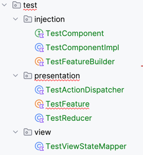

# KMM feature template plugin

To use this plugin, follow the next steps.

1. Run `./gradlew buildPlugin`
2. Find `kmm_templates-1.0.zip` in the `./build/distibutions` directory
3. In IDE settings open `Plugins` section
4. Click `Insttall from Disk` and select zip file.

5. Restart IDE
6. Right-click on the shared module root package to create a new feature

7. In the modal widow enter a feature name without a Feature postfix.

8. Enjoy 😘

